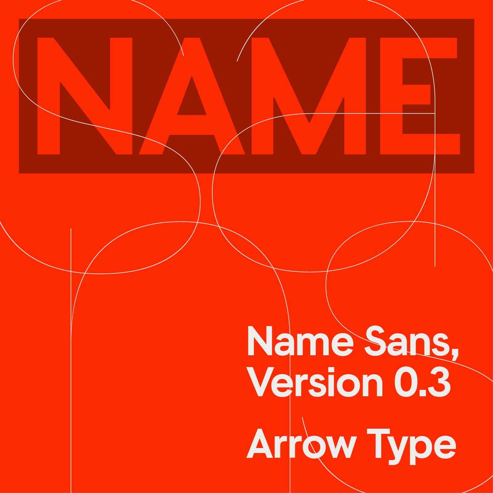
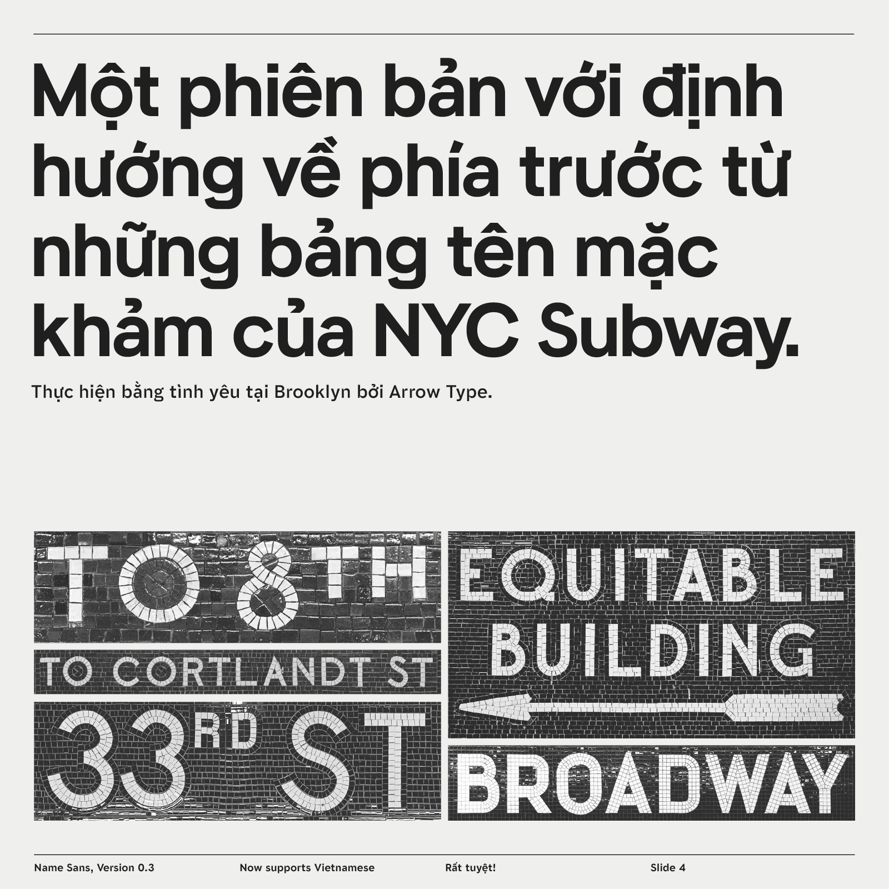
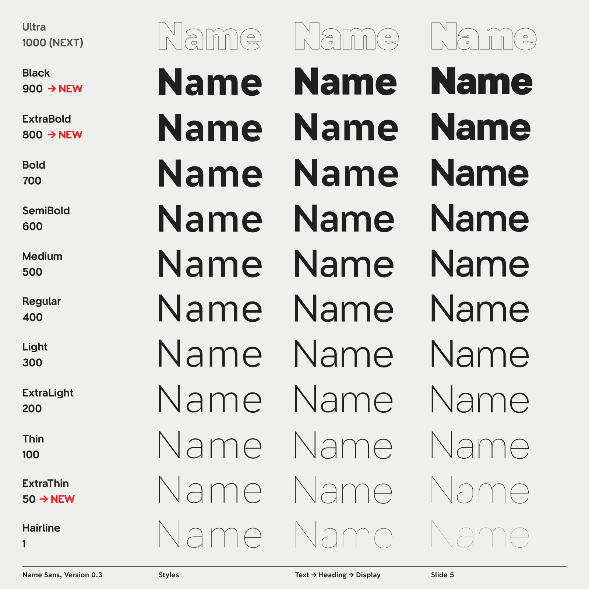
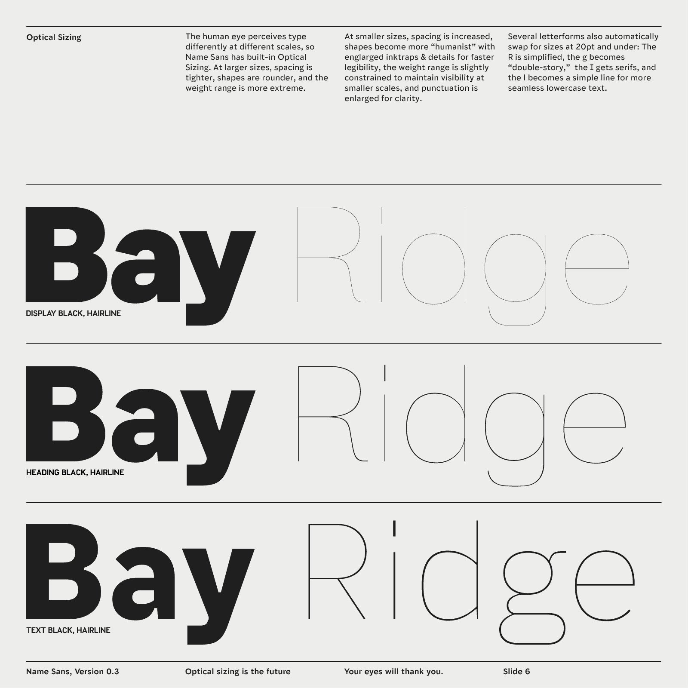
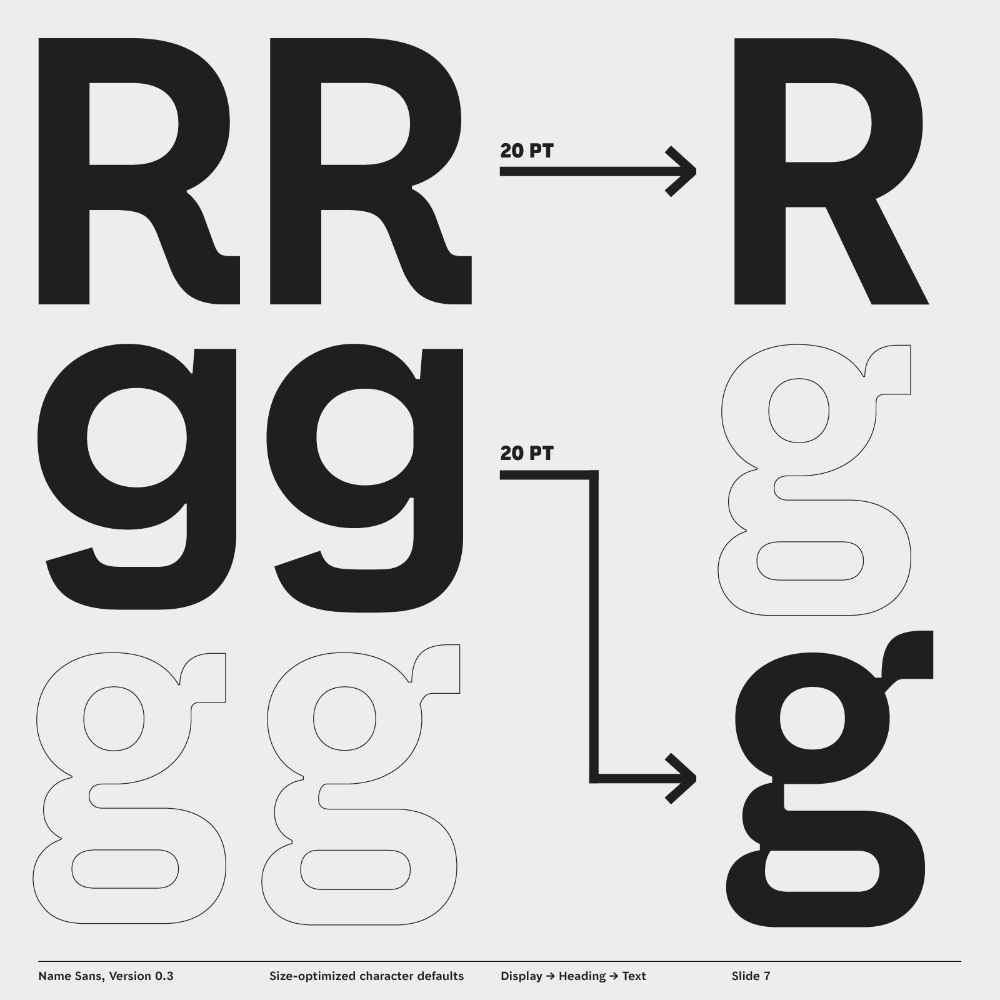
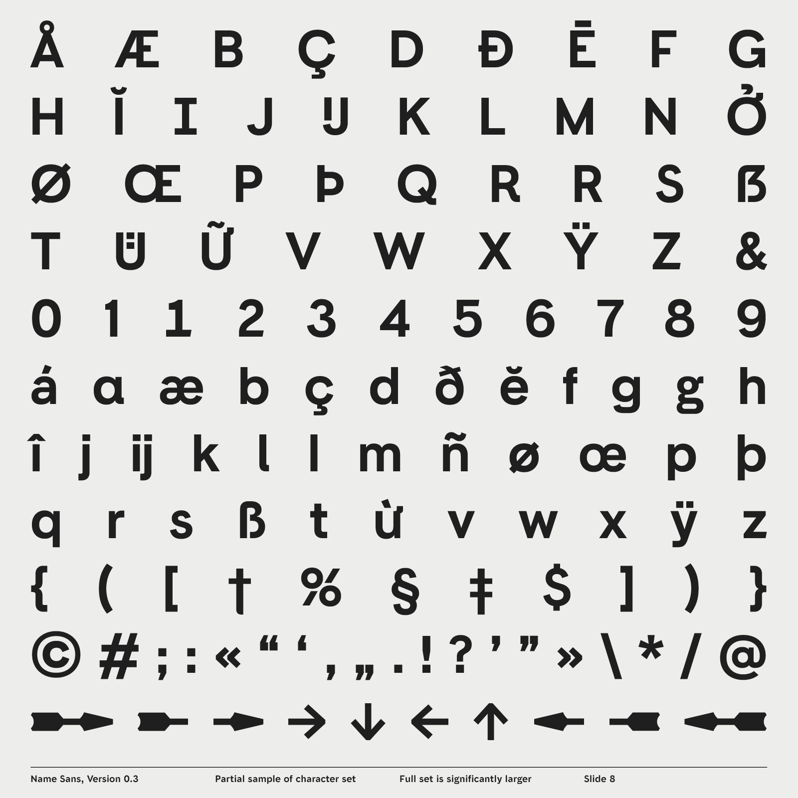
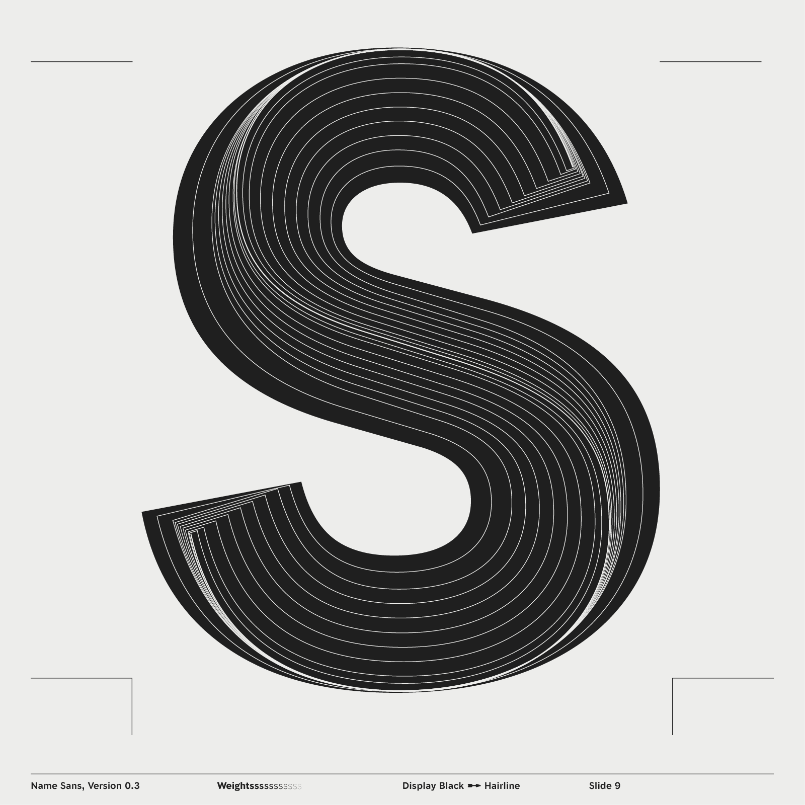

# Name Sans Roadmap

This repo is a public roadmap for Name Sans, currently in-progress and available at Future Fonts. Its primary purpose is to provide a central location for documenting issues and work currently being explored.

Do you have a question, feature request, or bug report for Name Sans? Awesome! Please file it in the [issues](https://github.com/arrowtype/name-sans-roadmap/issues).

*Note: Name Sans is ***not*** an open-source font. If you would like to try demo fonts or purchase a license for desktop & web usage, please go to https://www.futurefonts.xyz/arrowtype/name-sans.*

## Current Status

Name Sans is currently released in version `0.3`, with Weights 1–700 and Optical Sizes 12–96.

Follow along on Instagram ([@ArrowType](https://instagram.com/arrowtype)) or see more on [Future Fonts](https://www.futurefonts.xyz/arrowtype/name-sans).
